# Nua

## App Overview

Nua is a React Native product-listing app built with Expo SDK 57. Users browse a paginated catalog from DummyJSON, search and filter by category, open a product detail screen, manage a local cart, and open the return policy in an in-app WebView.

The app also tracks a small set of client-side analytics events, persists cart and theme preference, and degrades when the network drops.

## App Demo


<p align="center">
  <a href="https://www.loom.com/share/d35e3d5de622400a98fef574fb8f560b">
    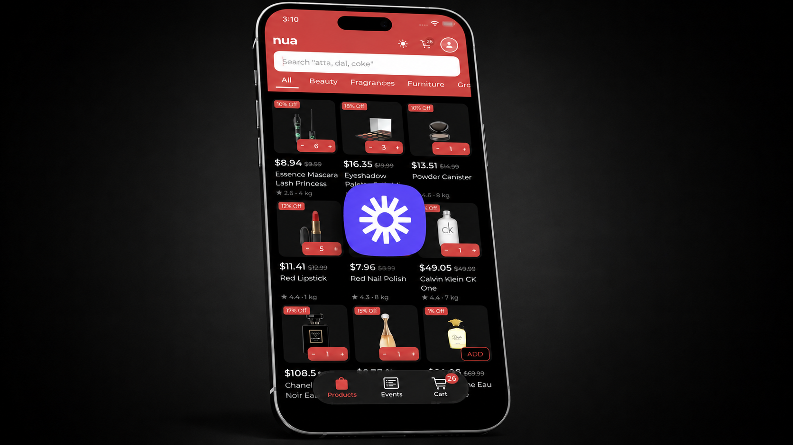
  </a>
</p>

### Screenshots

<table>
<tr>
<td width="50%">

**Listing (dark)**

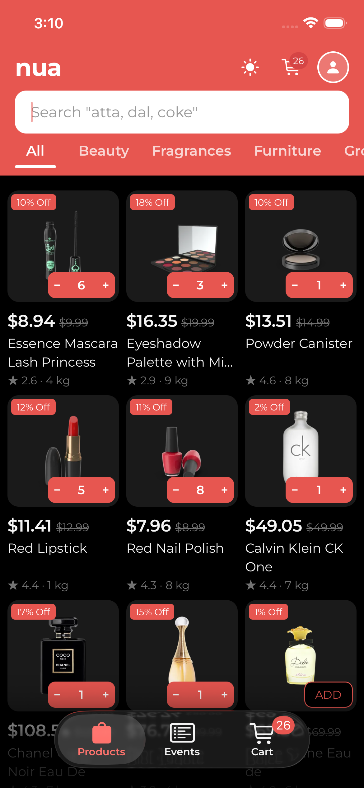

</td>
<td width="50%">

**Listing (light)**

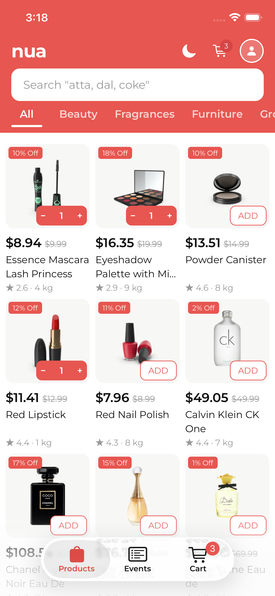

</td>
</tr>
<tr>
<td>

**Loading**

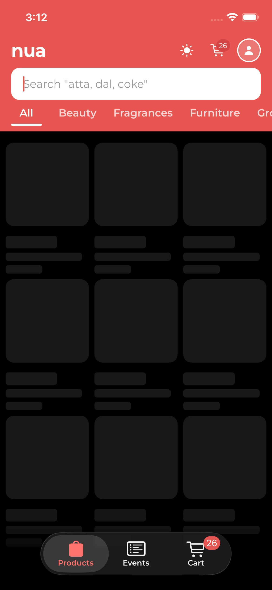

</td>
<td>

**Search**

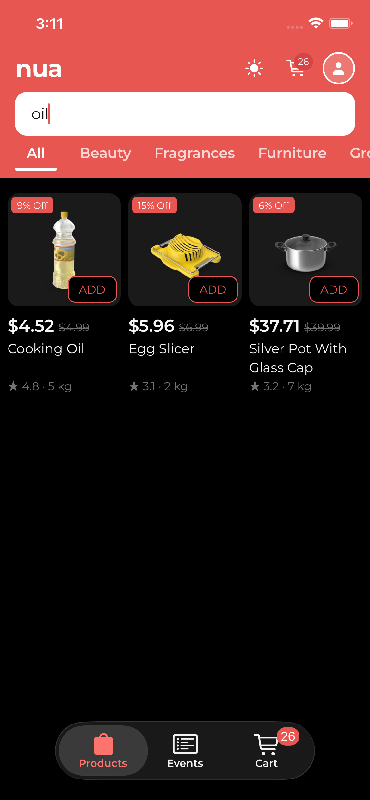

</td>
</tr>
<tr>
<td>

**Empty search**

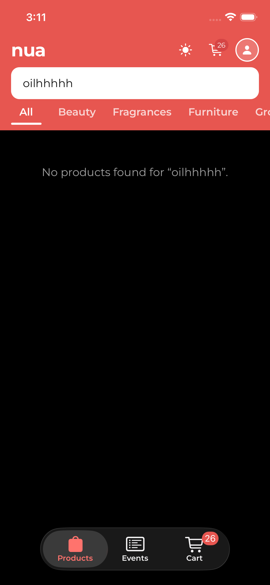

</td>
<td>

**Error + retry**

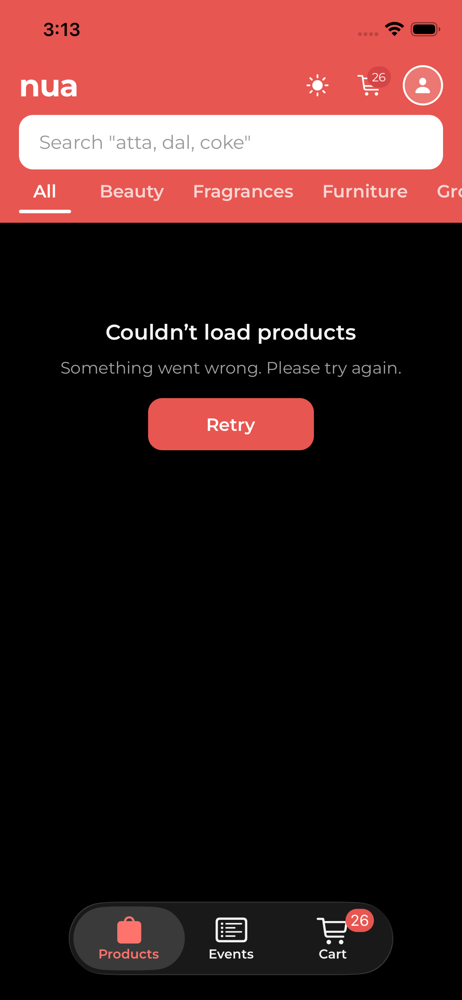

</td>
</tr>
<tr>
<td>

**Product detail**

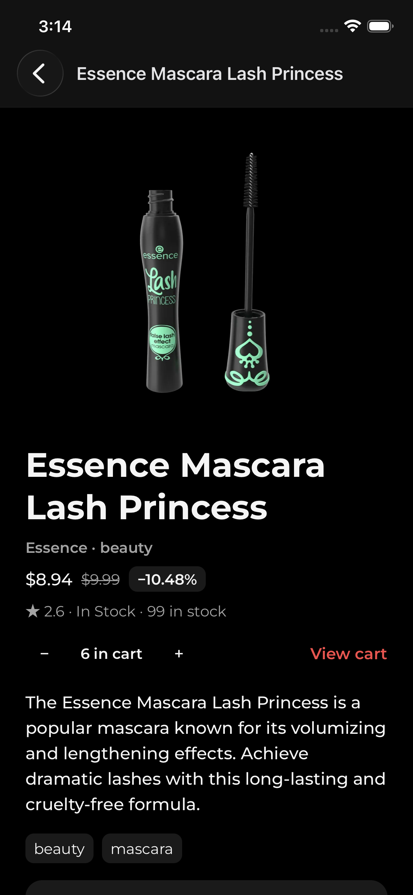

</td>
<td>

**Return policy (WebView)**

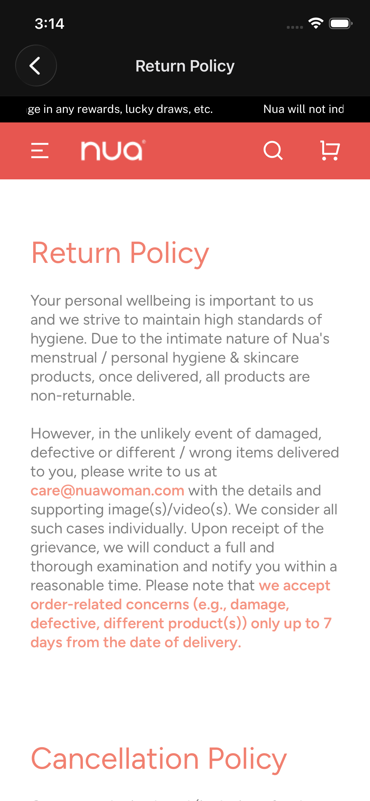

</td>
</tr>
<tr>
<td>

**Cart**

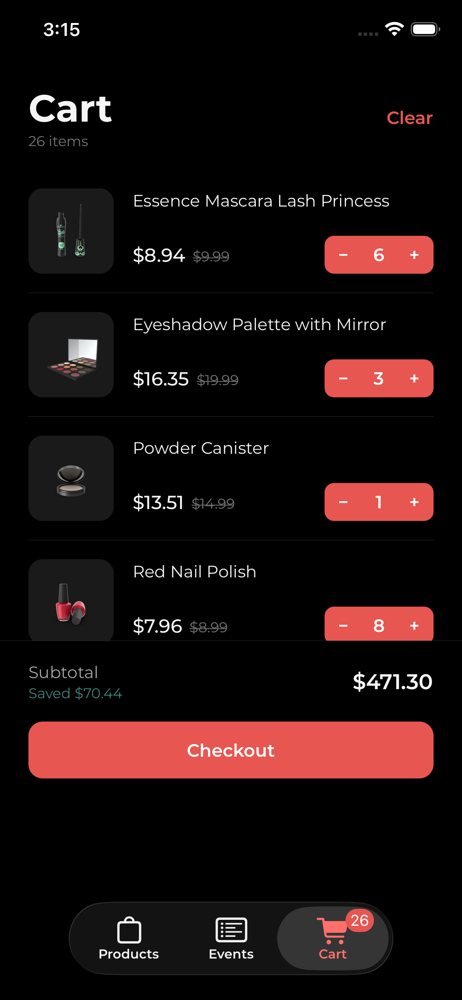

</td>
<td>

**Empty cart**

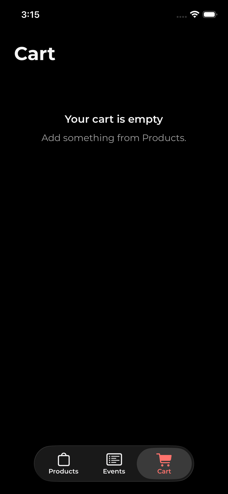

</td>
</tr>
<tr>
<td>

**Events log**

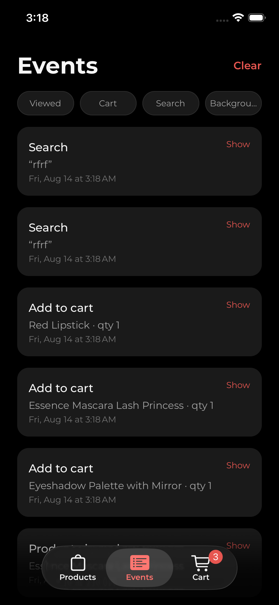

</td>
<td>

**Offline**

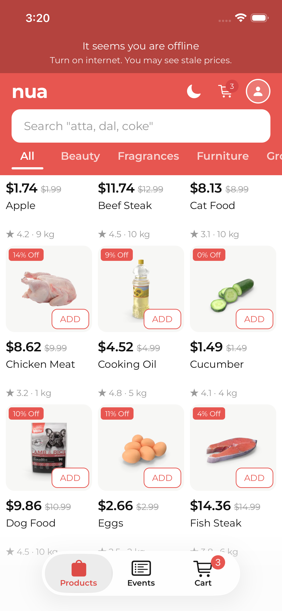

</td>
</tr>
</table>

## Features

| Feature | Implementation |
| --- | --- |
| Product listing | 3-column `FlatList`, DummyJSON `limit` / `skip`, page size 12 |
| Infinite scroll | `onEndReached` → `fetchNextPage()` |
| Pull to refresh | `refetch()`, independent of page-2 loading |
| Search | Debounced 400ms → `GET /products/search?q=` |
| Categories | DummyJSON `/products/categories` + chip filter |
| Product detail | Images, discounted price, stock, reviews, add to cart |
| Image carousel | Horizontal paging `ScrollView` when a product has multiple images |
| Cart | Add / increment / decrement / remove / clear |
| Quantity | Stepper on product card, detail, and cart row |
| Cart persist | Zustand + AsyncStorage (`nua-cart`) |
| Theme persist | Light / dark toggle, AsyncStorage (`nua-theme`) |
| Offline detection | NetInfo `isConnected`; banner + toasts |
| Cached listing | First default page written to AsyncStorage; served if that fetch fails |
| API retry | TanStack Query, up to 5 attempts, exponential delay |
| Loading | Product grid skeletons; WebView skeleton overlay |
| Error | List: “Couldn’t load products” + Retry. Detail: error message |
| Empty | No search matches; empty cart; empty events log |
| WebView | Return policy URL loaded in `react-native-webview` |
| Analytics | In-app Events tab: `product_viewed`, `add_to_cart`, `search_performed`, `app_backgrounded` |

Not implemented: checkout / order placement (button is UI-only), WebView ↔ JS messaging, analytics persist.

## Technical Implementation

**Stack.** Expo SDK 57, React Native 0.86, TypeScript, Expo Router (`NativeTabs` + stack for detail / return policy).

**API.** Shared axios client (`timeout: 15000`). Product URLs are built from `EXPO_PUBLIC_PRODUCTS_URL` (default `https://dummyjson.com/products`).

**Server state.** TanStack Query `useInfiniteQuery` / `useQuery`. Query keys include `search` and `category`. `staleTime` is 60s for lists, 5 minutes for categories. `networkMode: 'offlineFirst'` so `queryFn` still runs when Query thinks the device is offline (needed for the disk fallback).

**Client state.** Zustand for cart, theme, and the events log. Cart and theme use `persist` + AsyncStorage. Events stay in memory.

**Connectivity.** `@react-native-community/netinfo` drives both the UI (`useNetInfo`) and Query’s `onlineManager`. Online is `isConnected !== false` — `isInternetReachable` is ignored because it false-reports offline on iOS Simulator.

**Retries.** See [Offline & Network Resilience](#offline--network-resilience).

**Cancellation.** `queryFn` receives Query’s `AbortSignal` and forwards it to axios. Changing search or category changes the query key, which aborts the in-flight request.

**Lists.** Products, cart, and events use `FlatList`. Product `keyExtractor` is `String(item.id)`. Images use `expo-image` with `cachePolicy="memory-disk"`.

**WebView.** Loads a static Nua return-policy URL. Skeleton until `onLoadEnd` / `onError`. No `onMessage` / `injectedJavaScript` bridge.

## Offline & Network Resilience

When NetInfo reports disconnected:

- A banner is shown in the status-bar strip (“It seems you are offline…”).
- Coming back online shows a short “we are back” state, then hides.
- Load more, pull to refresh, and Retry toast and return if still offline.
- Tapping a product card does not navigate to detail (detail is a live `GET /products/:id` with no disk cache). Cart +/− still works.

**Cached products.** A successful default first page (`no search`, category `all`, `skip === 0`) is saved under `nua-products-first-page`. If that same request later fails (and is not aborted / not an API mock), the service returns the snapshot. Search, category, and later pages are not written to disk.

**Temporary API failures.** Query retries failed queries unless:

- already retried 5 times, or
- the error is axios with HTTP 400–499 (client errors are not retried).

Delay: `min(1000 * 2^attemptIndex, 8000)` → 1s, 2s, 4s, then 8s cap.

After retries are exhausted, the products list shows `ProductsErrorState` (offline copy vs generic “Something went wrong”) and a Retry button that calls `refetch()`. Product detail shows `error.message` only — no retry chrome.

## API & Error Handling

| Method | Path | Used for |
| --- | --- | --- |
| GET | `/products?limit=&skip=` | Paginated listing |
| GET | `/products/search?q=&limit=&skip=` | Search |
| GET | `/products/category/:slug?limit=&skip=` | Category listing |
| GET | `/products/categories` | Category chips |
| GET | `/products/:id` | Detail |

DummyJSON has no combined search + category URL. When both are set, the app searches with `limit=0` and filters `product.category === category` in JS (single page).

**Lifecycle (listing).** `isPending` → skeleton grid. Success → `FlatList` of products. Failure after retries → error + Retry. Empty result → “No products found for …” / “No products yet.” Footer spinner only while `isFetchingNextPage`.

**Cancellation.** Abort on query-key change (search/category). Aborted errors are rethrown and do not fall through to the disk cache.

**Graceful failure.** List: cache fallback for the default first page, otherwise error UI. Offline user actions: toast instead of a hung fetch. WebView: `onError` clears the skeleton so the screen is not stuck loading.

## Performance

- Product grid is a `FlatList` (`numColumns={3}`), not a mapped `ScrollView`.
- Infinite query loads 12 items per page; `onEndReachedThreshold={0.5}`.
- Cart quantity on a card uses `useCartStore(selectItemQuantity(product.id))` so a qty change does not subscribe the card to the full cart array.
- Events filter list is `useMemo`’d by selected pill.
- Product thumbnails and carousel images: `expo-image`, `cachePolicy="memory-disk"`.
- List keys: product id (string).
- `ProductCard` is not wrapped in `React.memo`.


## Architecture / Project Structure

```
src/
├── app/                 # Expo Router: tabs + product/[id] + return-policy
├── features/
│   ├── products/        # list, detail, search, cache, WebView
│   ├── cart/            # Zustand store + cart UI
│   └── events/          # analytics store, AppState listener, log UI
├── components/          # shared UI (banner, search, tabs, themed primitives)
├── hooks/               # net info, debounce, theme colors
├── lib/                 # QueryClient, screenshot/QA flags
├── services/            # axios instance
├── theme/               # palette, typography, theme store
└── utils/
```

`src/app/*` re-exports feature screens. Query functions live in `features/products/queries`. HTTP lives in `products-service.ts`.

## Trade-offs / Engineering Decisions

- **Zustand over Context for cart/theme.** Selectors keep a product card subscribed to one item’s quantity. Persist middleware maps cart and theme to AsyncStorage without a separate storage layer. Analytics `add_to_cart` is fired from the store mutation, not from each button.
- **TanStack Query for DummyJSON.** Pagination, abort, retries, and stale-while-revalidate are query problems. Putting pages in Zustand would duplicate that.
- **First-page disk cache only.** Showing a stale home grid when offline is useful. Caching page 2+ or search results would need eviction and would mis-report `hasNextPage`.
- **Retry backoff, skip 4xx.** Timeouts and 5xx are worth waiting; a 400 will not succeed on attempt 2. Retrying 4xx only delays the error UI.
- **`isConnected` only.** `isInternetReachable` marked the simulator offline while Wi‑Fi was on.
- **`offlineFirst`.** Default Query mode skips `queryFn` when offline, which would skip the AsyncStorage fallback.
- **FlatList + paging.** Catalog size is unbounded; a full in-memory list is not the DummyJSON contract (`limit` / `skip`).

## Setup & Run

```bash
npm install
cp .env.example .env   # optional; DummyJSON is already the default
npx expo start
```

Then open iOS Simulator, Android emulator, or Expo Go.

```bash
npm run ios
npm run android

```

Optional:

```
EXPO_PUBLIC_PRODUCTS_URL=https://dummyjson.com/products
```


## Known Limitations

- Checkout does not place an order.
- Product detail has no Retry button (list does).
- Detail, search, and extra pages are not disk-cached; offline users only get the last saved default first page (if any).
- Combined search + category is client-filtered because DummyJSON has no combined endpoint.
- Analytics events are not persisted across process death.
- A few Expo-template components remain under `src/components/` (`hint-row`, `collapsible`, `web-badge`, `external-link`) and are unused by the product flow.
